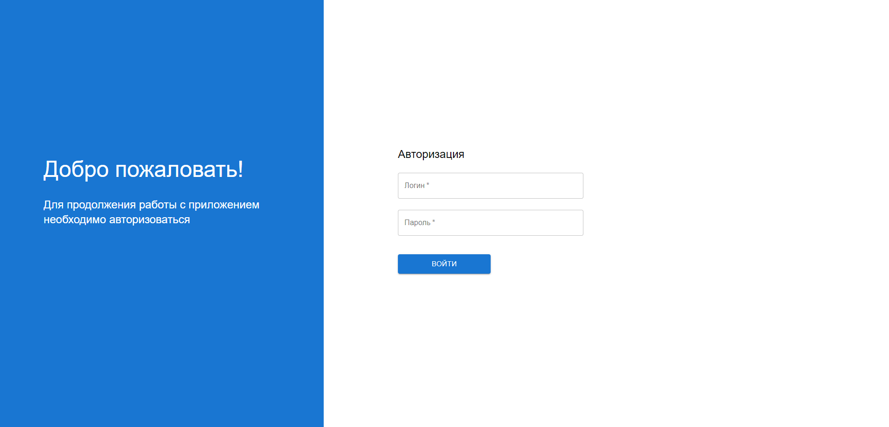
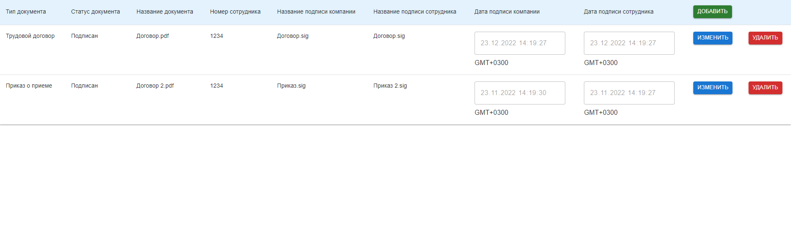
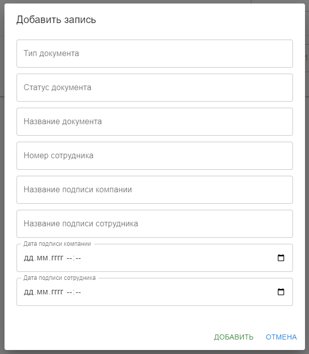
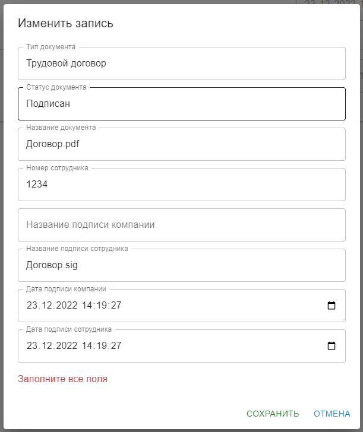
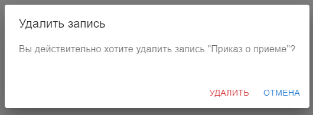

# О проекте

Данный проект реализует небольшое SPA-приложение с авторизацией и CRUD-операциями
Данные берутся из test.v5.pryaniky.com. 

## Использованные технологии
- React
- TypeScript
- Material UI
## Хостинг
Попробовать можно здесь [https://miraiy-outh.github.io/spa-table/](https://miraiy-outh.github.io/spa-table/)

## Авторизация
- Логин: user1
- Пароль: password

## Установка и запуск

Установить зависимости:
```bash
npm install
```
Запуск проекта:
```bash
npm run dev
```
## Превью страниц
### Авторизация

### Таблица

### Работа с таблицей




